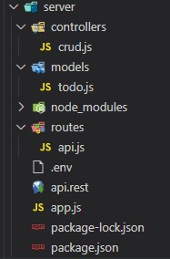

# REST API SERVER 構築
express (Node.js) と MongoDB を用いて RESTful な Server 環境を構築
# Table Of Contents
- [事前準備](#prep)
- [Directory 構成](#directories)
- 各構成ファイルの詳細説明
  - [schema.js](#schema)
  - [restapi.js](#restapi)
  - [.env](#env)
  - [app.js](#appjs)
  - [route.rest](#route)

<h2 id="prep">事前準備</h2>

### 以下のソフトウェアを事前にインストールしておく
- npm
- npx
- MongoDB
- 適当な Project Folder を作成 e.g., reet-server
- Project Folder 内で以下のコマンドを実行
```
npm init -y
npm i express mongoose nodemon dotenv express-validator
```
|項 目|説 明|
----|----
|express|Web Framework で今回は Rest API Server を構築する目的で利用|
|mongoose|MongoDB にアクセスするためのライブラリ|
|nodemon|各種ファイルを修正したときに Server を Restert してくれる|
|dotenv|.env ファイルにプログラムで参照する定数を定義する|
|express-validator|入力情報の可否を検証するバリデータ|

### package.json の編集
scripts の項目を以下の内容に置き換える
```
"scripts": {
  "start": "nodemon app.js"
},
```
- アプリケーションの起動
```
npm start
```
console
<pre>
> reset-server@1.0.0 start
> nodemon app.js

[nodemon] 2.0.15
[nodemon] to restart at any time, enter `rs`
[nodemon] watching path(s): *.*
[nodemon] watching extensions: js,mjs,json
[nodemon] starting `node app.js`
Server started.
Connected to Database
</pre>

<h2 id="directories">Directry 構成</h2>

|構 成|説 明|
----|----
||- schema.js: Table Schema を定義<br/>- restapi.js: REST API の Entrypoint<br/>- .env: 定数定義用<br/>- app.js: アプリケーション本体<br/>- route.rest: REST リクエストを容易に実現する|

<h2 id="schema">schema.js</h2>

```javascript
const mongoose = require('mongoose')

const apiSchema = new mongoose.Schema({
  username: {
    type: String,
    required: true
  },
  message: {
    type: String,
    required: true
  },
  date: {
    type: Date,
    required: true,
    default: Date.now
  }
})

module.exports = mongoose.model('messages', apiSchema)
```

<h2 id="restapi">restapi.js</h2>

```javascript
const express = require('express')
const router = express.Router()
const schema = require('../models/schema')

// Getting all
router.get('/', async function (req, res) {
    try {
      const messages = await schema.find()
      res.json(messages)
    } catch (err) {
      res.status(500).json({ message: err.message })
    }
  })

// Geting one
router.get('/:id', getMessage, (req, res) => {
  res.send(res.info)
})

// Creating one
router.post('/', async (req, res) => {
  const message = new schema({
    username: req.body.username,
    message: req.body.message
  })
  try {
    const newMessage = await message.save();
    res.status(201).json(newMessage)
  } catch (err) {
    res.status(400).json({ message: err.message })
  }
})

// Updating one
router.patch('/:id', getMessage, async (req, res) => {
  if (req.body.username != null) {
    res.info.username = req.body.username
  }
  if (req.body.message != null) {
    res.info.message = req.body.message
  }
  try {
    const message = await res.info.save()
    res.json(message)
  } catch (err) {
    res.status(400).json({ message: err.message })
  }
})

// Deleting one
router.delete('/:id', getMessage, async (req, res) => {
  try {
    await res.info.remove();
    res.json({ message: "Deleted message" })
  } catch (err) {
    res.status(500).json({ message: err.message })
  }
})

async function getMessage(req, res, next) {
  let info;
  try {
    info = await schema.findById(req.params.id)
    if (info == null) {
      return res.status(404).json({ message: "Cannot find information" })
    }
  } catch (err) {
    return res.status(500).json({ message: err.message })
  }
  res.info = info
  next()
}

module.exports = router
```

<h2 id="env">.env</h2>

```
SERVER_PORT=3000
DATABASE_URL=mongodb://localhost/local
```

<h2 id="appjs">app.js</h2>

```javascript
require('dotenv').config()

const express = require('express')
const app = express()
const mongoose = require('mongoose')

mongoose.connect(process.env.DATABASE_URL)
const db = mongoose.connection
db.on('error', (error) => console.error(error))
db.once('open', () => console.log('Connected to Database'))

app.use(express.json())

const restapiRouter = require('./routers/restapi')
app.use('/api', restapiRouter)
 
app.listen(process.env.SERVER_PORT, () => console.log('Server started.')
```

<h2 id="route">route.rest</h2>

```
GET http://localhost:3000/api

###
GET http://localhost:3000/api/61e5d8e76943935b68fb19d1

###
POST http://localhost:3000/api
Content-Type: application/json

{
  "username" : "Anonymous",
  "message": "Who am I?"
}

###
DELETE http://localhost:3000/api/61e65f8b96d5666cae52c3c7

###
PATCH  http://localhost:3000/api/61e5d8e76943935b68fb19d1
Content-Type: application/json

{
  "username" : "I've changed my name now."
}
```
